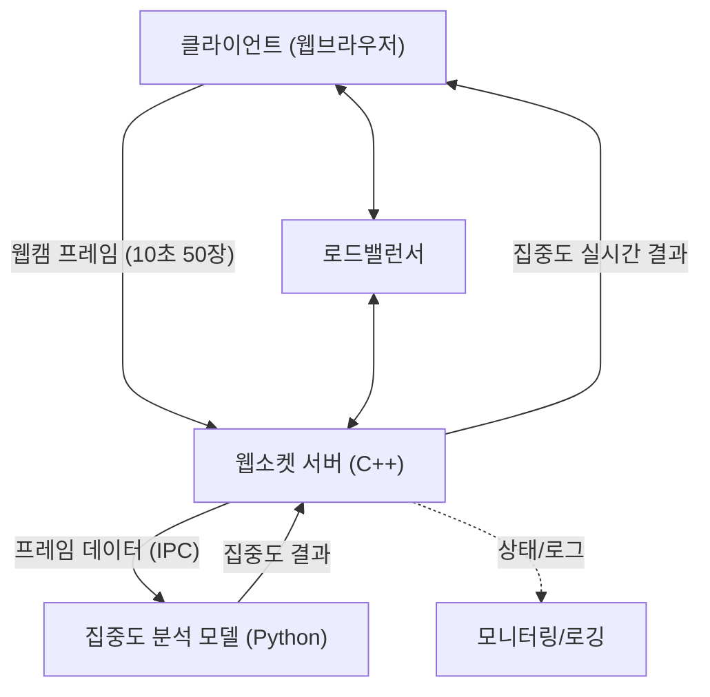

# WebSocket 서버 요구사항 및 아키텍처 명세

## 1. 서비스 개요

본 서비스는 로드밸런서(Load Balancer)를 통해 여러 인스턴스에 트래픽이 분산되는 환경에서,  
각 인스턴스 내 웹소켓 서버가 실시간으로 사용자의 학습 영상(프레임)을 수신하고  
동일 인스턴스 내의 AI 집중도 분석 모델(파이썬)과 연동하여  
집중도 결과를 실시간으로 사용자에게 제공하는 시스템입니다.

---

## 2. 주요 기능 명세 (Feature Specification)

### 2.1. 클라이언트 연결 관리 (Connection Management)

- 브라우저 클라이언트가 학습 시작 시 웹소켓 연결 수립
- 다수 사용자의 동시 연결 지원 및 세션 관리
- 연결 및 해제 이벤트 감지 및 로그 기록

### 2.2. 프레임 데이터 수신 (Frame Reception)

- 10초당 50프레임 단위의 이미지(캡처본) 실시간 수신
- 프레임 데이터의 순서 보장, 유실/중복/이상 프레임 처리
- 프레임 버퍼링(큐) 및 메모리 관리

### 2.3. AI 모델 연동 및 집중도 분석 (Model Inference & Analysis)

- 파이썬 프로세스에서 모델 로드 및 집중도 분석
- 웹소켓 서버 ↔ 파이썬 모델 간 데이터 교환(IPC: Inter-Process Communication)
- 프레임을 일정 단위로 모델에 전달, 집중도 결과 수신

### 2.4. 실시간 결과 전송 (Realtime Result Delivery)

- 분석된 집중도 결과를 웹소켓을 통해 클라이언트에 실시간 전송
- 사용자별 세션과 결과값 매핑

### 2.5. 예외 및 에러 처리 (Error Handling)

- 프레임 포맷 이상, 모델 연산 오류, 연결 이상 등 상황별 예외 처리
- 예외 발생 시 사용자에게 오류 메시지 전송 및 로그 기록

### 2.6. 로깅 및 모니터링 (Logging & Monitoring)

- 연결/해제, 프레임 수신, 모델 연산, 에러 발생 등 로그 기록
- 인스턴스별 처리량, 응답 속도, 리소스 사용량 등 모니터링 지원

---

## 3. 시스템 아키텍처 및 구현 흐름



## 4. 계층별 책임 분리 및 구조

### 4.1 계층 구조 (Directory Structure)

```plain
MyWebSocketServer/
├── src/
│   ├── main.cpp                 # 엔트리포인트
│   ├── server/                  # 웹소켓 서버 엔진
│   │   └── WebSocketServer.{h,cpp}
│   ├── handler/                 # 메시지 핸들러(라우팅 테이블)
│   │   ├── FrameHandler.{h,cpp}      # 프레임 수신 및 큐잉
│   │   ├── ModelHandler.{h,cpp}      # 모델 연동 및 결과 처리
│   │   └── ErrorHandler.{h,cpp}      # 에러/예외 처리
│   ├── ipc/                     # C++ ↔ Python IPC 연동 모듈
│   │   └── IPCManager.{h,cpp}
│   ├── utils/                   # 공통 유틸리티(로그, 파싱 등)
│   │   └── Logger.{h,cpp}
│   └── config/                  # 설정 관리
│       └── Config.{h,cpp}
├── external/                    # uWebSockets 등 외부 라이브러리
└── include/
```

### 4.2. 계층별 책임 (Responsibility)

| 계층      | 주요 책임(Key Responsibility)                 |
| ------- | ----------------------------------------- |
| main    | 서버 실행, 환경설정, 의존성 주입(핸들러/모듈 등록)            |
| server  | 웹소켓 연결 관리, 이벤트 루프, 세션 및 클라이언트 식별          |
| handler | 수신 메시지 라우팅, 프레임 핸들링, 에러 핸들링, 결과 가공 및 전송   |
| ipc     | 파이썬 모델과 데이터 교환(프레임 전달, 결과 수신), IPC 오류 핸들링 |
| utils   | 로깅, 파싱, 공통 함수 제공                          |
| config  | 환경변수 및 서버/모델 설정값 관리                       |
